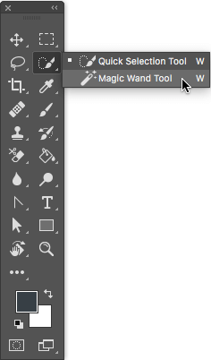
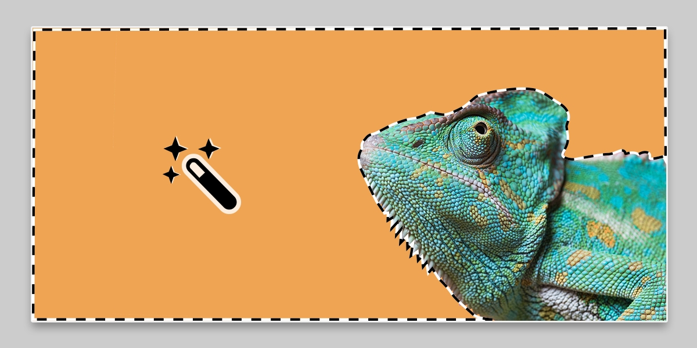
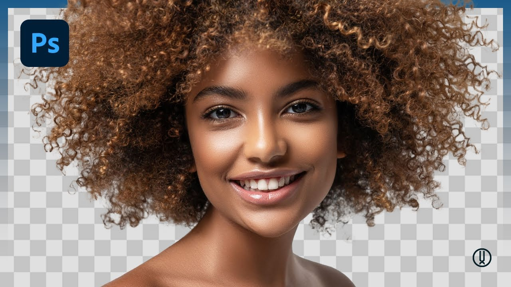

# Photoshop Tools
## Magic wand 
### Unlock the Power of Photoshop's Magic Wand Tool!
**Introduction** 

Imagine being able to quickly and accurately select objects, remove backgrounds, or make complex edits with just a few clicks. By mastering the Magic Wand tool, you'll take your photo editing skills to the next level and save valuable time on every project. 

1. **Select the Magic Wand Tool:**  In the Tools panel, click on the Magic Wand Tool icon. You can also press the keyboard shortcut "W" to select the Magic Wand Tool.
 
 

3. **Adjust Tool Settings:** At the top of the Photoshop window, you will see the Options Bar. Here, you can adjust the tool settings including Tolerance (which determines how similar in color a pixel must be to the selected pixel to be included in the selection), Sample Size, and Anti-aliasing. 
![alt text] 

4. **Making your selection:** Click on the area of the image you want to select with the Magic Wand Tool. It will select pixels based on the color and tone of the pixel you clicked on.
 

5. **Refine the Selection:** To add to the selection, hold down the Shift key and click on additional areas you want to select. To subtract from the selection, hold down the Alt/Option key and click on the areas you want to remove. 
 {width: 300px; height: 200px;}

6. **Edit the Selection:** Once you have made your selection, you can edit it further by applying adjustments, filters, or transformations to the selected area. 

7. **Deselect:** To deselect the area, you can go to the Select menu and choose Deselect, or use the keyboard shortcut Ctrl+D (Windows) or Command+D (Mac). 

### Video tutorial:  
**Magic wand tutorial** https://www.youtube.com/watch?v=Dl9TYrUzeMc

# Saving your file 

 **JPEG/JPG:** JPEG is a widely used format for photographs and web graphics. It offers a good balance between file size and image quality. JPEGs use lossy compression, meaning some image data is discarded, which can result in a loss of quality if the file is repeatedly edited and saved. 

**To save as JPEG/JPG:** 

- Go to File > Save As. 
- Choose JPEG from the Format dropdown menu.
- Adjust the Quality slider to control the file size and image compression level. 
- Click Save. 

**PNG:** PNG is a popular format for web graphics and images that require transparency. It supports lossless compression, meaning image quality is preserved even with repeated edits and saves. PNGs tend to have larger file sizes compared to JPEGs. 

**To save as PNG:** 

- Go to File > Save As. 
- Choose PNG from the Format dropdown menu. 
- Click Save. 

**GIF:** GIF is mostly used for simple graphics, animations, and web icons. It supports transparency and animation. However, GIF has limited color reproduction (256 colors), making it unsuitable for complex images or photographs.  

**To save as GIF:**
- Go to File > Save As. 
- Choose GIF from the Format dropdown menu. 
- Click Save. 

**TIFF:** TIFF is a highly versatile format suitable for professional print work and high-quality images. It supports lossless compression, multiple layers, transparency, and high-bit depths. TIFF files tend to be large in size. 

 **To save as TIFF:** 
- Go to File > Save As. 
- Choose TIFF from the Format dropdown menu. 
- Click Save. 

**PSD:** PSD is Photoshop's native file format, which preserves all layers, adjustments, and editable elements. PSD files are ideal for retaining full editing capabilities and working on projects that need ongoing modifications. 

**To save as PSD:** 
- Go to File > Save As. 
- Choose PSD from the Format dropdown menu. 
- Click Save. 

**How to save a file in Photoshop:** How to save a file in photoshop https://www.youtube.com/watch?v=72SCsp0aBms&pp=ygUfaG93IHRvIHNhdmUgYSBmaWxlIGluIHBob3Rvc2hvcA%3D%3D 

 

Remember to consider the purpose, quality, and intended use of your image when choosing the appropriate file format. 
