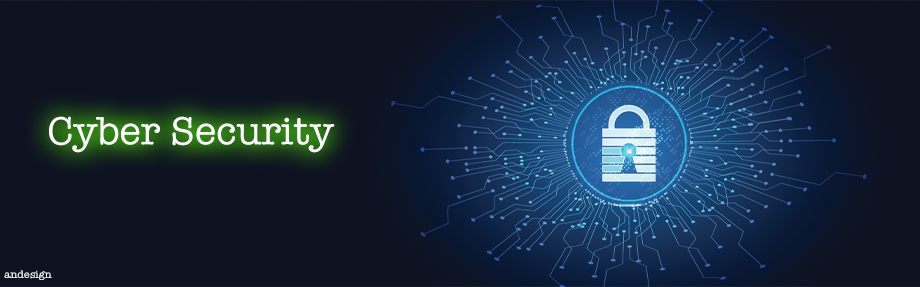

# Cyber Security
## 1. Security Principles 
Cybersecurity principles are fundamental to protecting information and systems against digital attacks. Here is a list of each principle and how they contribute to a highly effective security posture:

- **Confidentiality**: This principle ensures that information is only accessed by authorized individuals. It is protected through solutions such as encryption and access control.

- **Integrity**: This principle ensures that information is not altered by unauthorized individuals, keeping it accurate and complete. This is maintained through hashes, digital signatures, and regular audits.

- **Availability**: Refers to the guarantee that authorized users have continuous access to information and resources. This is achieved with system redundancy, regular backups, and disaster recovery plans.

- **Authentication**: Verifies the identity of users before granting access to systems. Common methods include passwords, security tokens, and biometrics.

- **Non-Repudiation**: Prevents a party from denying the authorship or receipt of a transaction. This is often implemented using digital signatures and audit logs.
This principle is essential to ensuring the integrity of electronic transactions and creating a trusted digital environment.

- **Authorization**: Defines what a user can and cannot do within a system after being authenticated. This includes read, write, and execute permissions.

- **Auditing**: Involves monitoring and recording user activity to detect and investigate suspicious or unauthorized activity.

- **Awareness and Training**: Ensures that all users are aware of security threats and know how to act safely.

- **Incident Response**: Establishes procedures to respond quickly to security breaches, minimizing damage and restoring normal operations.

- **Disaster Recovery**: Prepares plans for the rapid recovery of systems and data after a security incident.

- **Business Continuity**: Ensures that essential business operations can continue during and after a security incident.

- **Risk Management**: Identifies, assesses, and prioritizes risks, applying resources to minimize, monitor, and control the probability and/or impact of unwanted events.

- **Encryption**: Uses mathematical algorithms to protect the confidentiality and integrity of data during transmission and storage.

- **Physical Security**: Protects hardware, software, and infrastructure from physical attacks and natural disasters.

These principles are the backbone of an effective cybersecurity strategy and should be taken seriously by organizations and individuals to protect against growing digital threats. It is crucial that readers understand the importance of implementing these practices to maintain the security of their information and systems.

## 2. Vulnerabilities
Security flaws in web applications are a major concern for developers and system administrators. Here are some of the most common:

- **SQL Injection (SQL Injection)**: Occurs when an attacker inserts a malicious SQL query into an input field, such as a form, to manipulate or access unauthorized data. This can lead to the exposure of confidential information, data corruption, or loss of control over the database.

- **Cross-Site Scripting (XSS)**: An attacker exploits an XSS vulnerability by inserting malicious scripts into web pages that are displayed to other users. These scripts can steal cookies, sessions, or personal data from users, or even rewrite the content of the web page.

- **Cross-Site Request Forgery (CSRF)**: In this type of attack, a malicious user tricks a web browser to perform unwanted actions on a website where the user is authenticated. This can result in unwanted state changes or actions being performed without the user's knowledge.

In addition to these, there are other important vulnerabilities such as:

**1. Access Control Break**: Allows attackers to access features or data without the proper permission.
**2. Incorrect Security Configuration**: Improper security settings can expose sensitive information or compromise the security of the application.
**3. Use of Components with Known Vulnerabilities**: Using outdated or known-flawed libraries and frameworks can leave the application vulnerable to attack.

## 3. Prevention Techniques

Prevention techniques in cybersecurity are essential to protect web applications from threats and attacks. Here are some of the recommended practices:
| Techniques |
|----------|
| - **Education and Continuous Training**: It is crucial to promote regular training to keep employees informed about the latest threats and how to prevent them. | 
| - **Identity and Access Management**: Implement strong authentication and authorization policies to control access to critical resources. | 
|- **Updates and Maintenance**: Keep all systems and software up to date with the latest security patches to protect against known vulnerabilities. | 
| - **Regular Backups**: Perform frequent backups and restoration tests to ensure data recovery in case of an attack or failure. | 
|- **Regular Backups**: Perform frequent backups and restoration tests to ensure data recovery in case of an attack or failure. |
| - **Defense in Layers**: Use multiple layers of security, such as firewalls, antivirus, and intrusion detection systems, to create redundancy. | 
|- **Incident Response Planning**: Develop and test incident response plans to be prepared to act quickly in case of a security breach.|
| - **Physical Security**: Protect equipment and data centers against unauthorized physical access. | 
| - **Regular Risk Assessment**: Conduct periodic risk assessments to identify and mitigate potential security vulnerabilities. |

## 4. Security Tools:

**Protect your web application with the right tools.**
There are various tools and software programs that can help identify and mitigate security risks in web applications. Below, we list some examples and their functions:
| Tools |
|----------|
|**Web Application Firewalls (WAFs)** : Protect against common attacks like SQL injection and XSS. Work by examining web traffic and blocking suspicious activity. Example: Cloudflare.|
|**Vulnerability Scanning Tools**: Identify security vulnerabilities in applications and infrastructure. Allow for proactive patching of flaws before they are exploited by attackers. Examples: Rapid7, WhiteHat.|
|**Security Scanners**: Perform automated scans for known vulnerabilities in web applications. Speed up the process of identifying flaws  and   facilitate     remediation.xample: StackHawk.|
|**Password Managers**: Assist in creating and storing strong passwords. Reduce the risk of brute-force and phishing attacks. Example: NordPass.|
|**Anti-Malware Solutions**: Offer protection against various types of malware, such as phishing, spyware, and ransomware.Are essential for protecting the web application and its users against malicious attacks. Examples: Avast, Kaspersky.|
|**Risk Analysis Tools**: Allow for the identification of potential risks and the development of strategies to mitigate them.Assist in creating a robust and effective security plan.Examples: Brainstorming, SWOT analysis.|

**Remember**:

The choice of tools should consider the specific needs of your application and infrastructure.
It is important to keep the tools and software updated to ensure maximum protection.
Web application security is an ongoing process that requires constant attention.

## 5. Study case

**Real-World Security Breaches and How They Could Have Been Prevented**
Analyze some real-world examples of security breaches and discuss how they could have been prevented:

|**1. Central Bank of Brazil Data Breach**|**Prevention**|
|-----------------------------------------|--------------|
 |In January 2022, personal data linked to PIX keys was exposed due to a security incident at a payment company. Information such as full name, CPF, branch number, and account number were potentially exposed.| This incident could have been prevented with more rigorous data security management, frequent audits, and the implementation of stronger access controls to protect sensitive information.|

|**2. Marriott International**|**Prevention**|
|-----------------------------|--------------|
 In 2018, Marriott International suffered a data breach that affected about 500 million customers. Hackers accessed information such as names, email addresses, and travel details. | The adoption of a more robust cybersecurity strategy, including the encryption of sensitive data and continuous monitoring of systems to detect suspicious activity, could have minimized the risk of such a breach

|**3. Phishing Attacks**|**Prevention**|
|------|---|
 Phishing remains one of the main forms of security breach, where attackers use fraudulent emails or messages to deceive victims and obtain confidential information.|  Continuous education and training of employees on cybersecurity and the implementation of advanced email filters can significantly reduce the risk of phishing attacks|

These examples highlight the importance of a proactive and layered approach to cybersecurity, which includes both technology and human awareness to prevent security breaches.

Here are some additional details about each of the security breaches mentioned:

**Central Bank of Brazil Data Breach**:
The data breach was caused by a vulnerability in the security of the payment company's systems. The exposed data could be used for identity theft, fraud, and other malicious purposes.The Central Bank of Brazil is investigating the incident and has taken steps to mitigate the risks to customers.

**Marriott International Data Breach**:
The data breach was caused by a hacker attack on Marriott's systems.
The exposed data could be used for identity theft, fraud, and other malicious purposes.
Marriott International has taken steps to improve its cybersecurity and is offering free credit monitoring to affected customers.

**Phishing Attacks**:
Phishing attacks are often disguised as legitimate emails or messages from trusted sources.
Phishing attacks can be used to steal confidential information, such as passwords, credit card numbers, and social security numbers.
It is important to be aware of the signs of phishing attacks and to never click on links or open attachments in suspicious emails.
By taking steps to prevent security breaches, organizations can protect their data and their customers from harm.

## 6. Legislation and Compliance

The **Brazilian General Data Protection Law (LGPD)**, which came into effect in August 2020, is the primary legislation governing the use and protection of personal data in Brazil. The law applies to any data processing carried out within the Brazilian territory, or to data processing activities aimed at offering or providing goods or services to individuals located in Brazil.

|Key provisions of the LGPD include:|
|-----|
|- **Respect for Privacy**: The law is built on the foundation of respecting the privacy of individuals.|
|- **Informational Self-Determination**: Individuals have the right to control their personal data.
|- **Freedom of Expression**: The law ensures that data protection does not infringe on the freedom of expression, information, communication, and opinion.
|- **Inviolability of Intimacy**: The LGPD protects the intimacy, honor, and image of individuals.
|- **Economic and Technological Development**: The law supports innovation while ensuring data protection.|

To ensure that web applications comply with data protection laws like the LGPD, organizations should take the following steps:

1. **Understand Applicable Laws**: Be aware of the data protection laws that apply to your operations, such as the LGPD for Brazil or the GDPR for the European Union.
2. **Data Mapping**: Know what data you collect, where it comes from, how it's processed, and where it's stored.
3. **Privacy Policy**: Have a clear and accessible privacy policy that outlines how personal data is handled.
4. **User Consent**: Obtain explicit consent from users for the collection and processing of their data.
5. **Data Subject Rights**: Allow users to access, rectify, erase, and port their data.
6. **Security Measures**: Implement appropriate technical and organizational measures to protect personal data.
7. **Data Breach Protocol**: Have a plan in place to respond to data breaches, including notification procedures.
8. **Training**: Ensure that staff are trained on data protection principles and compliance requirements⁶⁷.

By following these guidelines, organizations can work towards compliance with the LGPD and other similar data protection laws, thereby protecting the personal data of their users and avoiding potential legal issues.

## 7. Maintenance and Monitoring: 

1. **Adopt a DevSecOps Approach**: Integrate security practices into the development lifecycle to address vulnerabilities early on¹.

2. **Secure the Software Development Life Cycle (SDLC)**: Implement security measures at every stage of the SDLC, from design to deployment and maintenance².

3. **Address Open-Source Vulnerabilities**: Regularly scan for and update open-source components to mitigate known vulnerabilities¹.

4. **Principle of Least Privilege**: Ensure that users and applications have only the minimum necessary permissions to perform their functions².

5. **Secure Data Storage and Transmission**: Encrypt sensitive data both at rest and in transit to protect against unauthorized access².

6. **Monitoring and Observability**: Use tools to monitor the health and performance of applications, and observe for signs of security incidents².

7. **Regular Security Testing and Auditing**: Conduct automated and manual security testing to proactively identify and fix vulnerabilities².

8. **Incident Response Plan**: Have a clear plan for responding to security incidents, including communication strategies and recovery steps².

9. **Security Awareness Training**: Educate all team members about security best practices and the importance of their role in maintaining security².

10. **Enable Automatic Software Updates**: Where possible, configure applications to automatically install updates to ensure timely application of patches³.

11. **Avoid Unsupported Software**: Do not use end-of-life software that no longer receives security updates³.

By following these practices, organizations can enhance their security posture, minimize risks, and ensure that their applications remain secure against evolving threats. Remember, security is an ongoing process that requires regular attention and adaptation to new challenges.
