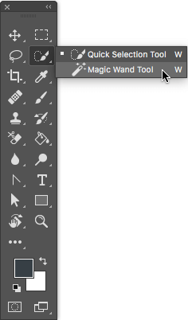
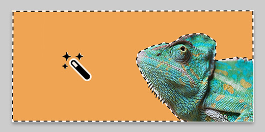

![alt text][def]

# Photoshop Tools
## Magic wand 
### Unlock the Power of Photoshop's Magic Wand Tool!
**Introduction** 

Imagine being able to quickly and accurately select objects, remove backgrounds, or make complex edits with just a few clicks. By mastering the Magic Wand tool, you'll take your photo editing skills to the next level and save valuable time on every project. 

1. **Select the Magic Wand Tool:**  In the Tools panel, click on the Magic Wand Tool icon. You can also press the keyboard shortcut "W" to select the Magic Wand Tool.

2. **Adjust Tool Settings:** At the top of the Photoshop window, you will see the Options Bar. Here, you can adjust the tool settings including Tolerance (which determines how similar in color a pixel must be to the selected pixel to be included in the selection), Sample Size, and Anti-aliasing.
   

4. **Making your selection:** Click on the area of the image you want to select with the Magic Wand Tool. It will select pixels based on the color and tone of the pixel you clicked on.
   
 

6. **Refine the Selection:** To add to the selection, hold down the Shift key and click on additional areas you want to select. To subtract from the selection, hold down the Alt/Option key and click on the areas you want to remove
   
   

8. **Edit the Selection:** Once you have made your selection, you can edit it further by applying adjustments, filters, or transformations to the selected area. 

9. **Deselect:** To deselect the area, you can go to the Select menu and choose Deselect, or use the keyboard shortcut Ctrl+D (Windows) or Command+D (Mac). 

### Video tutorial:  
[Magic wand tutorial](https://www.youtube.com/watch?v=Dl9TYrUzeMc)

[def]: Layout.png
