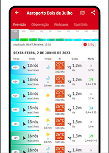
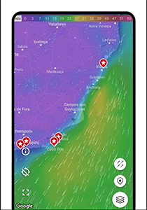
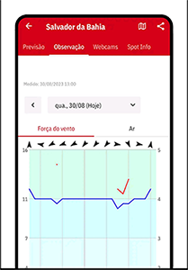

# Windfinder

## The weather in the palm of your hand
If you are one of those who like to know about the weather in all aspects, Windfinder is for you.
Windfinder is a comprehensive application designed to provide detailed forecasts for wind, weather, and waves, as well as tide information for over 160,000 locations worldwide. It is an essential tool for outdoor sports enthusiasts, including kitesurfers, sailors, windsurfers, surfers, fishermen, and paragliders.

### Features

**Detailed Forecasts:** 
Windfinder offers wind and weather forecasts in 3-hour intervals, reaching up to 10 days into the future.

**Animated Maps:** Animated wind maps provide an overview of wind conditions on a regional and global scale.

**Real-Time Measurements:** Real-time measurements of wind speed and direction, air temperature, atmospheric pressure, and more are provided by over 21,000 weather stations.

**Wind Alerts:** Receive notifications when ideal wind conditions are forecasted.

**Widgets:** Add widgets to your home screen for quick access to current conditions at your favorite locations.

### How to Use Windfinder
**1. Download the App:** Available for iOS and Android.
[Android](https://play.google.com/store/apps/details?id=com.studioeleven.windfinder&pcampaignid=web_share)
[IOS](https://apps.apple.com/app/windfinder/id336829635)

**Create an Account:** Register to personalize your experience.

**Set Up Your Favorite Locations:** Keep track of wind and weather conditions.

**Check the Forecasts:** Plan your outdoor activities based on detailed forecasts.

**Utilize Widgets:** Quickly access wind information from your device’s home screen.

